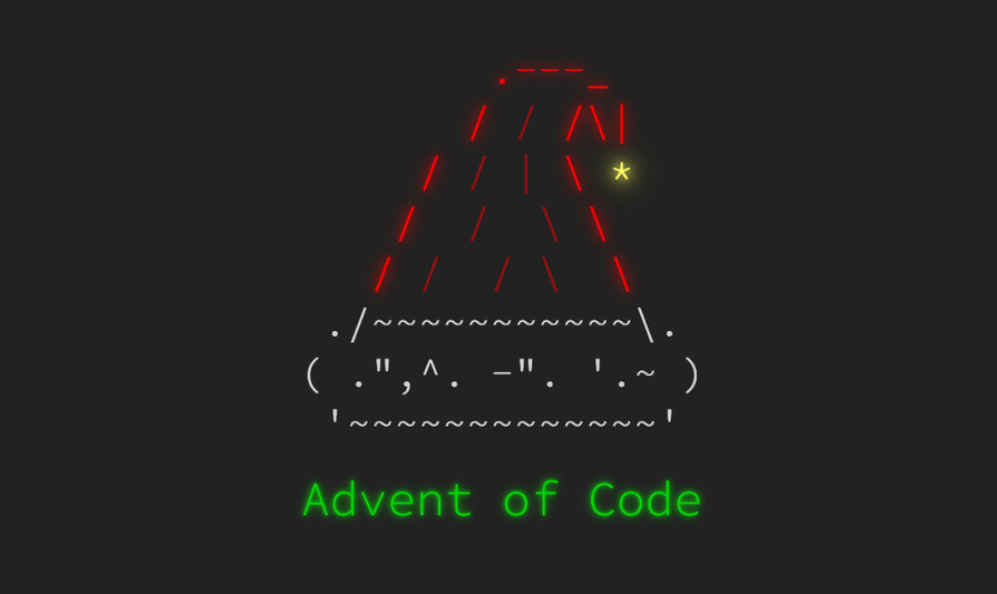

# **Advent Of Code by IncredibleLego**

This repository contains all my solutions to the [Advent Of Code](https://adventofcode.com/) problems implemented in Golang. Not all solutions are present and not all are well implemented, with time I will try to update the repo with all my solutions in the most optimized way possible. You are free to use this solutions as you want to

## Solved exercises

### **2024**

* Day 1  : ⭐⭐
* Day 2  : ⭐
* Day 3  : ⭐
* Day 4  : ⭐⭐
* Day 5  : ⭐⭐
* Day 6  : ⭐
* Day 7  : ⭐
* Day 10 : ⭐⭐

### **2023**

* Day 1  : ⭐⭐
* Day 2  : ⭐⭐
* Day 4  : ⭐⭐
* Day 7  : ⭐
* Day 8  : ⭐⭐
* Day 9  : ⭐⭐
* Day 10 : ⭐

### **2021**

* Day 6  : ⭐⭐
* Day 9  : ⭐⭐

*Francesco Corrado 2024*
